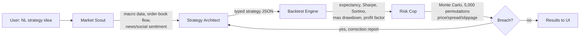

# Architecture

Product context: [exec-summary.md](exec-summary.md).
Rules and constraints that this architecture must satisfy: [CLAUDE.md](../CLAUDE.md).

## The four-agent loop

LangGraph orchestrates a fixed sequence of four agents. Every strategy passes
through all four, in order; none may be skipped. The Risk Cop can send a
strategy back to the Architect on a breach — that is the only feedback edge
in the graph.

## Agent responsibilities

1. **Market Scout** — pulls macro data, order-book flow, and news/social
   sentiment relevant to the strategy's target assets. Feeds context to the
   Architect; does not itself produce or modify the strategy.
2. **Strategy Architect** — maps the natural-language concept plus Scout
   context into a strictly-typed strategy JSON. Never emits raw code.
3. **Backtest Engine** — runs the strategy JSON against historical,
   point-in-time-adjusted data with realistic fills and costs, and reports
   expectancy, Sharpe, Sortino, max drawdown, and profit factor.
4. **Risk Cop** — runs a 5,000-permutation Monte Carlo over price, spread,
   and slippage. On a breach of platform limits it raises an exception and
   returns a correction report to the Architect rather than passing with a
   warning.

## Data flow

- **In:** a natural-language strategy description from the user.
- **Contract between agents:** the strategy JSON schema. A schema change
  updates validators on both the producing and consuming agent in the same
  PR.
- **Out:** a results payload (metrics + full distribution, not just the best
  run) surfaced to the UI as tagged events, plus the risk report.
- Backtest results are never cached across a data-provider change.

## Stack

| Layer | Choice |
|---|---|
| Orchestration | LangGraph |
| Backtesting | vectorbt or LEAN (5,000-iteration Monte Carlo, must stay under 10s vectorized) |
| Data | Polygon.io (equities/forex), Binance or CoinGecko Pro (crypto) |
| Frontend | Next.js + Tailwind |
| LLM endpoints | Configurable per agent; no model name hardcoded outside config |

## Status

The four-agent loop is wired as a LangGraph `StateGraph`
([src/cip/agents/graph.py](../src/cip/agents/graph.py)) with all four
agents implemented as stubs: the Scout returns fixed fake context, the
Architect selects a fixture by keyword, the Backtest Engine derives
seeded pseudo-metrics, and the Risk Cop enforces real hardcoded gates
with a correction-loop retry cap. The strategy schema and validator
layer are real and enforced at every agent boundary. Data providers,
LLM calls, the vectorbt backtest engine, and the frontend are not yet
built — web-platform architecture is recorded in
[decisions/0002-web-architecture.md](decisions/0002-web-architecture.md).
Update this file as agents are actually implemented; treat divergence
between this doc and the code as a bug in one of the two.
